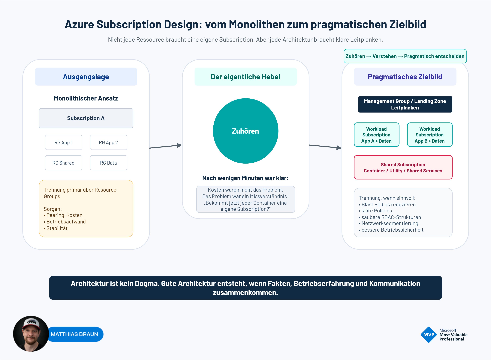

# Azure Subscription Design

Dieses Repository enthält eine praxisnahe Entscheidungshilfe für die Strukturierung von Azure Subscriptions.

Anhand eines realen Architekturbeispiels wird gezeigt, wie sich monolithische Azure-Umgebungen mit wenigen Subscriptions von workload-orientierten Zielbildern unterscheiden und welche Rolle dabei Governance, Sicherheit, RBAC, Netzwerksegmentierung und Betriebsaufwand spielen.

Ziel ist nicht die maximale Trennung um jeden Preis, sondern eine pragmatische Architekturentscheidung basierend auf Anforderungen, Risiken und betrieblichen Rahmenbedingungen.

Die dargestellten Empfehlungen orientieren sich am Microsoft Cloud Adoption Framework (CAF) sowie an Erfahrungen aus Enterprise-Projekten.

## Inhalt

Dieses Repository beinhaltet:

- Referenzgrafik zum Azure Subscription Design
- Entscheidungsvorlage für die Subscription-Segmentierung (.docx und .md)
- Gegenüberstellung von monolithischen und workload-orientierten Zielbildern
- Architekturprinzipien für Governance, Sicherheit, Betrieb und Netzwerksegmentierung
- Praxisempfehlungen aus realen Enterprise

## Attribution

Wenn diese Inhalte verwendet oder weiterentwickelt werden, freue ich mich über eine Nennung des ursprünglichen Repositorys oder eine Verlinkung auf dieses Projekt.
